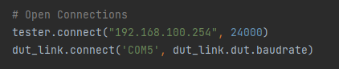
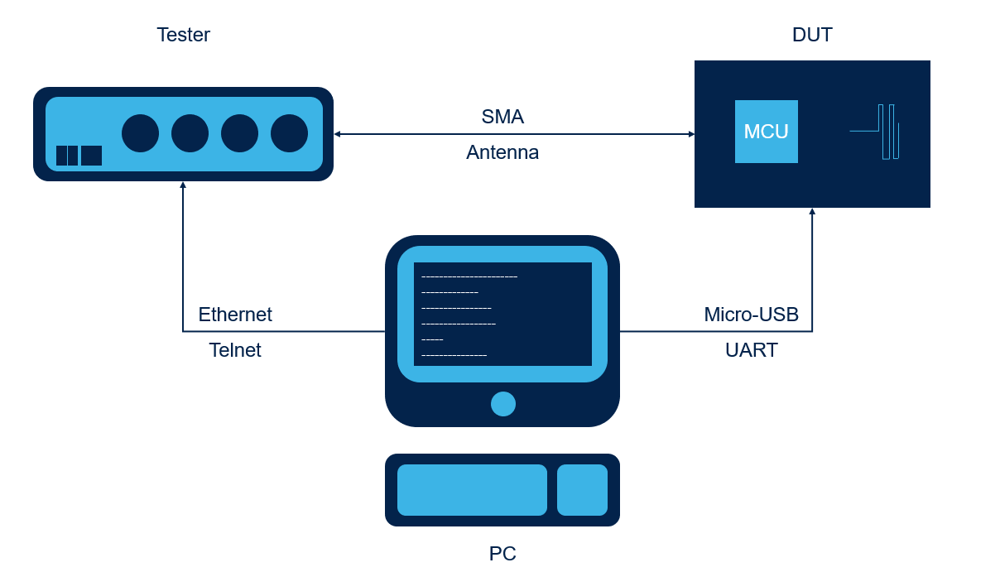
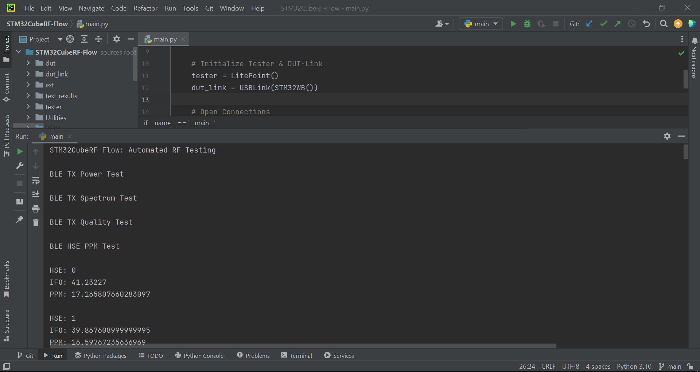

# STM32CubeRF-Flow: Automated RF Testing

* The STM32CubeRF-Flow is a Python application example that demonstrates how to automate RF Testing.
* This example creates and maintains a connection to 2 devices:
    * DUT (Device Under Test) via a Serial UART Connection
    * BLE Tester via a Telnet Connection
* The application will send HCI/ACI commands to the DUT and SCPI commands to the Tester to control both devices and perform a number of RF tests.
* Predefined RF Tests:
    * BLE TX Power Test
        * This test will initialize the DUT as a Transmitter and the Tester as a Vector Signal Analyzer (VSA) to perform a TX Power analysis.
        * The power over the given number of packets, the peak power, and average power will be output in the results.
        * The Pass Verdict based on the Output Power Transmitter Test from the BLE SIG RFPHY Test Suite (section 4.5.1) will also be output in the results.
    * BLE TX Spectrum Test
        * This test will initialize the DUT as a Transmitter and the Tester as a VSA to perform a TX Spectrum analysis.
        * The bandwidth over the given number of packets and the average will be output in the results.
    * BLE TX Quality Test
        * This test will initialize the DUT as a Transmitter and the Tester as a VSA to perform a TX Quality analysis.
        * The TX Quality over the given number of packets will be output in the results.
    * BLE HSE PPM Test
        * This test will tune the High Speed External Clock (HSE) over a range of HSE Tune values and test the TX Quality at each HSE value to find the optimal HSE and Parts Per Million (PPM).
        * The optimal HSE and PPM as well as all tested HSE, Initial Frequency Offset (IFO), and PPM values will be output in the results.
    * BLE RX PER Test
        * This test will initialize the Tester as a Vector Signal Generator (VSG) and the DUT as a Receiver to perform and calculate the Packer Error Rate (PER) over a given number of BLE Packets.
        * The total number of packets, number of received packets, and calculated PER will be output in the results.

## Documentation

* STM32WB [HCI/ACI Commands](https://www.st.com/resource/en/application_note/an5270-stm32wb-bluetooth-low-energy-wireless-interface-stmicroelectronics.pdf)
* STM32WBA HCI/ACI Commands (CubeWBA: Middlewares/ST/STM32_WPAN/ble/stack/doc/STM32WBA_BLE_Wireless_Interface.html)
* BlueNRG [HCI/ACI Commands](https://www.st.com/resource/en/user_manual/um1865-the-bluenrgms-bluetooth-le-stack-application-command-interface-aci-stmicroelectronics.pdf)
* LitePoint [SCPI Commands](https://www.litepoint.com/faq/where-is-iqxel-m-documentation/)

    * A list of SCPI Bluetooth Classic / Low Energy commands can be found within the Tester GUI (Admin > Documentation > SCPI Reference > Channel Modules > BT).
    * For example, the following command is used for the HSE PPM Test to read the IFO results.
    
        

## Hardware Needed

* One Windows PC / Laptop

* One DUT:
    * [P-NUCLEO-WB55](https://www.st.com/en/evaluation-tools/p-nucleo-wb55.html) (STM32WB55)

    * [NUCLEO-WBA52](https://www.st.com/en/evaluation-tools/nucleo-wba52cg.html) (STM32WBA52)

    * [STEVAL-IDB011V2](https://www.st.com/en/evaluation-tools/steval-idb011v2.html) (BlueNRG-LP) [Limited Functionality]

* One BLE Tester:
    * [LitePoint IQxel-M](https://www.litepoint.com/products/iqxel-m/)

* Cables:
    * One Micro-USB to USB-A Cable

    * Ethernet Cable

    * [SMA Cable](https://www.minicircuits.com/WebStore/dashboard.html?model=CBL-4FT-SMSM%2B)

## Software Needed

* [PyCharm Python IDE](https://www.jetbrains.com/pycharm/)

* DUT DTM (Direct Test Mode) FW:
    * STM32WB: BLE Transparent Mode in [CubeWB FW Package](https://www.st.com/en/embedded-software/stm32cubewb.html)
  
    * STM32WBA: BLE Transparent Mode in [CubeWBA FW Package](https://www.st.com/en/embedded-software/stm32cubewba.html)
    
    * BlueNRG: BLE DTM Uart in [BlueNRG-LP DK SW Package](https://www.st.com/en/embedded-software/stsw-bnrglp-dk.html)

* [STM32CubeProgrammer](https://www.st.com/en/development-tools/stm32cubeprog.html)

## User Guide

1) Open the Python project in PyCharm or your preferred IDE.

    

2) Set the Tester, DUT, and DUT connection type.

    a) By default, the example is set to use the LitePoint as a Tester, the STM32WB as the DUT, and USBLink (UART) as the DUT connection type.

    

3) Open the Tester and DUT Link connections.

    a) By default, the example opens the Tester Telnet connection and DUT UART connection with the following settings.

    

    b) Change the Tester IP Address parameter to match your Tester's IP Address.

    c) Change the DUT Link COM Port to match the port used by your DUT. This can be checked under the Ports section in Device Manager.

    

4) Initialize the RF Test Flow.

    

    a) This is an example custom class that performs predefined RF Tests and will create a folder using the device's UID & a CSV file for each test.

    > **Note:** Folder creation using the device's UID is supported by the STM32WB & STM32WBA. For the BlueNRG-LP, a folder with the name "unknown" will be created.

    b) An example of the test results for a NUCLEO-WB55 can be found under [test_results](test_results/test_results_0000bcf8).

    

5) Perform BLE RF Tests.

    a) By default, the example will run the predefined RF Tests configured for the NUCLEO-WB55.

    

    > **Note:** For the BlueNRG-LP, these tests may need modifications / different configurations. Some tests such as the BLE HSE PPM Test are not functional on the BlueNRG-LP due to differences in supported HCI/ACI commands.

    b) You can also manually send commands to the DUT & Tester instead of using the predefined RF Tests. You may find an example of this by looking at the test functions in [rf_flow.py](rf_flow.py).

    

    > **Note:** A limited number of HCI/ACI & SCPI commands are currently supported. The name, opcode, or number of parameters for HCI/ACI commands may change in future Wireless Stack updates.

6) Close the Tester and DUT Link connections.

    

7) Flash the BLE DTM Firmware on the DUT.

    a) STM32WB: BLE Transparent Mode + latest BLE Full Wireless Stack ([tutorial](https://youtu.be/1LvfBC_P6eg)) using CubeProgrammer.

    
    
    b) STM32WBA: BLE Transparent Mode using CubeProgrammer.

    

    c) BlueNRG-LP: BLE DTM UART using BlueNRG-LP Navigator. 

    

8) Connect the DUT, Tester, and PC.

    

9) Run the Python application.

    a) If using the predefined RF Tests, a folder will be generated in [test_results](test_results) with a csv file for each test. The test progress will also be printed out on the console.

    

    b) The application can also be ran in the Command Prompt using the 'python main.py' command.

    

## Troubleshooting

**Caution** : Issues and the pull-requests are **not supported** to submit problems or suggestions related to the software delivered in this repository. The STM32CubeRF-Flow example is being delivered as-is, and not necessarily supported by ST.

**For any other question** related to the product, the hardware performance or characteristics, the tools, the environment, you can submit it to the **ST Community** on the STM32 MCUs related [page](https://community.st.com/s/topic/0TO0X000000BSqSWAW/stm32-mcus).